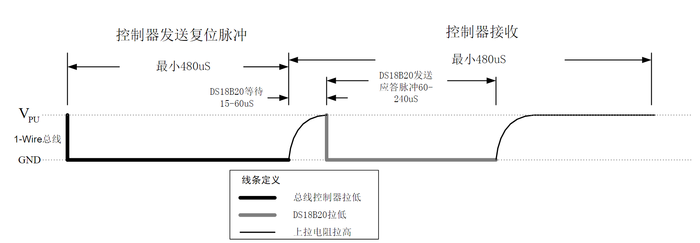

> [!NOTE] 唠一唠
> 今天是学习单片机的第55天，这一周有些厌学，前面4天几乎没有学。我觉得跟着视频课程学习，效果不太好，在学完后几日便会忘记，因此，今天，我自己去翻了翻详细资料，想要独立完成对于温度传感器DS18B20的应用。
> 想法很美好，可惜学艺不精，成功了一半：看懂了相关资料，但是写不出来代码。最终还是通过视频学习完善代码思路。

##  初步认识DS18B20
我看完文档后，对DS18B20的总结就一句话：一个集测温，温度预警，能用数据传输线供电的小设备。
可以用于-55°C~+125°C的温度测量（~~丢沸水里头~~），低于-10 °C或 85 °C时具有0.5°C的精度，其余范围，其内部温度采集精度可以自定义，最高为0.0625 °C。
## 进一步学习
### 数据的传输
DS是一个温度传感器，就是测量温度，其原理应当和热敏电阻差不多，但它可以在其内部直接计算出温度并可以通过数据线DQ发送给控制器，使用起来方便不少。
既然要进行数据的传输工作，就得了解DS使用的是什么通讯协议：==1-wire总线通信协议==
### One-Wire总线通信协议
`该协议定义多个信号形式：复位脉冲，存在脉冲，写0，写1，读0，读1。主设备执行除了存在脉冲外的所有其他信号。`
#### 初始化程序
[]


<center>初始化时序</center>
根据上述时序图，结合DS使用手册的讲述：


>在初始化序列期间，总线上的主设备通过拉低1-Wire 总线超过480us 来发送（TX）复位脉冲。之后主设备释放总线而进入接收模式（RX）。当总线释放后，5kΩ左右的上拉电阻将1-Wire 总线拉至高电平。当DS18B20 检测到该上升边沿信号后，其等待15us 至60us 后通过将1-Wire 总线拉低60us 至240us 来实现发送一个存在脉冲

我们可以得到，控制器要先拉低总线超480us，再拉高释放，我们可以在释放后60us~240us查看总线状态，如果被拉低，说明DS18B20返回存在脉冲；据此，我写出了OneWire的初始化函数：
```C
//OneWire_DQ是定义的数据线接口
unsigned char OneWire_Init(void){
    unsigned char i, AckBit;
    
    OneWire_DQ = 1;OneWire_DQ = 0;//确保时序从头开始，方便操作
	i = 227; while (--i);//延时480us以上
    OneWire_DQ = 1;
    i = 29;  while (--i);//延时70us左右
    AckBit = OneWire_DQ;
    i = 227; while (--i);//延时480us以上
    
    return AckBit;//返回应答值
}
```
